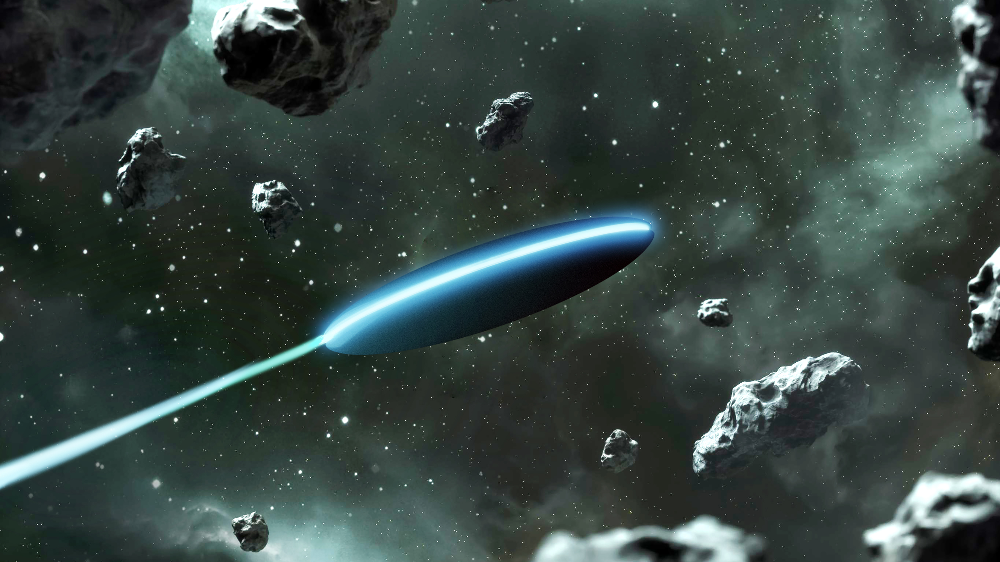
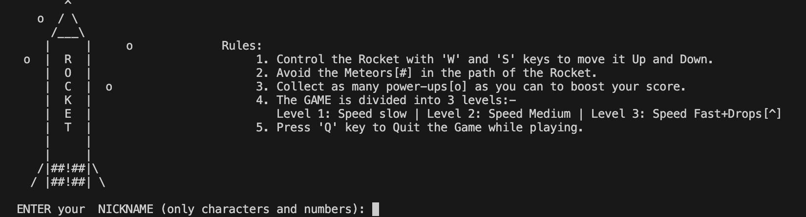
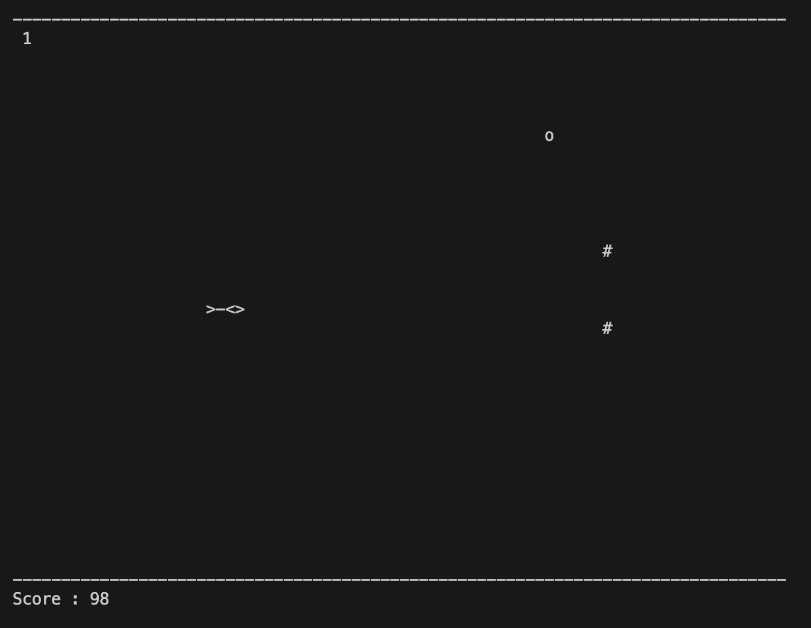
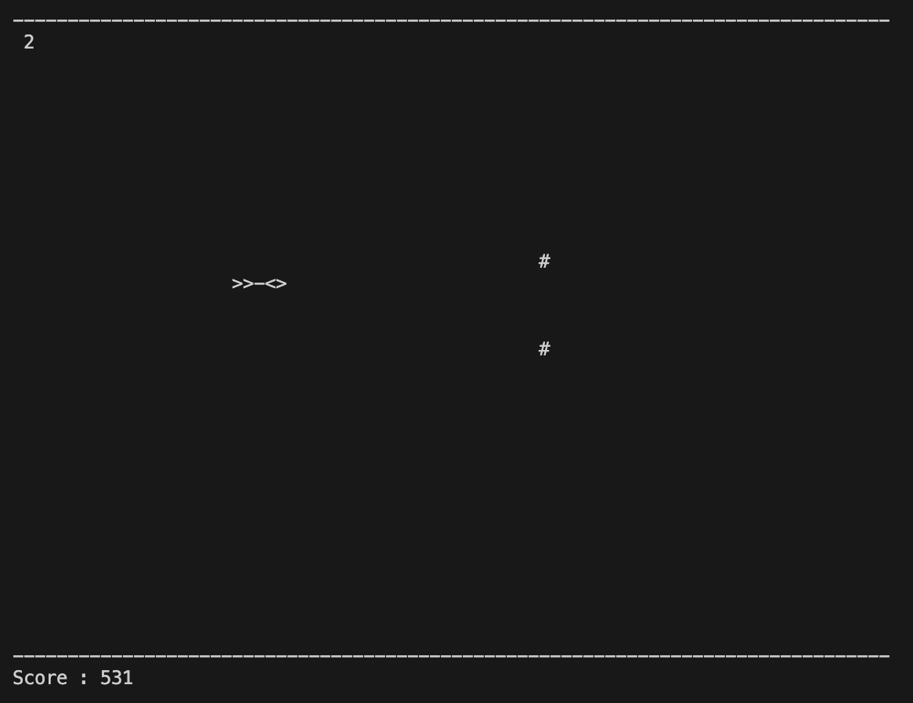
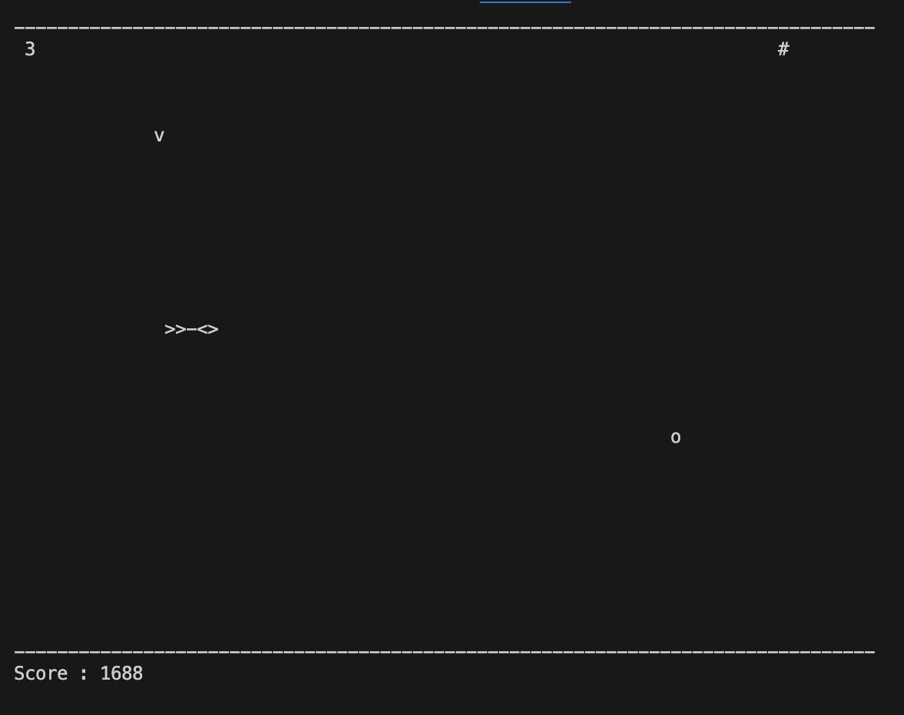
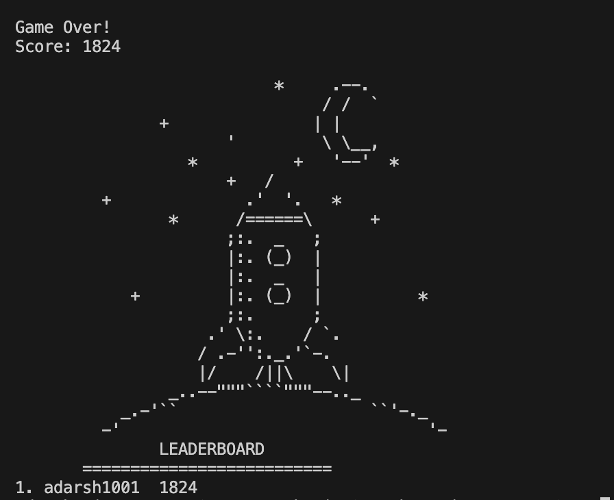

# Rocket Game

Welcome to the Rocket Game! This is a simple interactive game implemented in C++ using the ncurses library.
<!-- Include Font Awesome CSS -->
<link rel="stylesheet" href="https://cdnjs.cloudflare.com/ajax/libs/font-awesome/5.15.4/css/all.min.css" />

<!-- Add an icon in the README -->
<i class="fas fa-rocket"></i>
:rocket: 


## Features

- Navigate a rocket through obstacles
- Collect power-ups for score boosts
- Three levels of increasing difficulty
- Interactive controls

## Prerequisites

Before running the game, ensure you have the following installed:

- C++ compiler
- ncurses library [MAC-specific]

## Getting Started

1. **Clone the Repository**
   ```bash
   git clone https://github.com/your-username/rocket-game.git
   ```
2.**Compile the Game**

Navigate to the Game folder
```bash
cd rocket-game
```
Compile the game program
```bash
g++ -o rocket_game main.cpp -lncurses
```
3.**Run the Game**
```bash
./rocket_game
```

------------------------
## Gameplay

# Rocket Adventure: Space Explorer

Welcome to Rocket Adventure, where you embark on an exhilarating journey through the vast expanse of space! Take control of your rocket as you navigate through a series of challenging obstacles, collect power-ups, and strive to achieve the highest score possible. This README guide will provide you with all the necessary information to dive into the adventure.

## Gameplay Overview:

- **Objective:** Navigate the rocket through space, avoiding collisions with obstacles while collecting power-ups to increase your score.
  
- **Controls:** 
  - Use the **W** and **S** keys to control the vertical movement of the rocket.
  - Activate lateral movement when Level 3 is reached:
    - **A:** Move the rocket to the left.
    - **D:** Move the rocket to the right.
  - **F:** Fire the laser when Level 3 is reached, destroying the front meteor.

- **Obstacles:**
  - **Meteors:** Beware of meteors drifting through space. Colliding with them will result in a game over.
  - **Air-Drops:** Beware of the drops from the above when you reach Level 3 of the game.
  
- **Power-ups:** 
  - Collect power-ups marked as [o] to boost your score by 50 points. Seize them whenever possible to maximize your score.
  
- **Levels:** 
  - **Level 1 (Score < 500):** Begin your journey at a leisurely pace. The speed is slow, allowing for easier navigation through space.
  - **Level 2 (500 ≤ Score < 1000):** As you progress, the challenge intensifies. The speed increases to a medium pace, testing your reflexes and agility.
  - **Level 3 (Score ≥ 1000):** Reach the pinnacle of space exploration. The speed becomes fast, and additional challenges await with air-drops [^] threatening to destroy your rocket if its tail is hit.

## How to Play:

1. Clone the repository to your local machine.
2. Open the project directory and launch the game.
3. Use the W/S keys to maneuver the rocket through space.
4. Use A/D keys to move laterally and F key to fire the laser in Level 3.
5. Collect power-ups for additional points and avoid collisions with meteors.
6. Progress through levels by achieving higher scores and test your skills in increasingly challenging environments.
7. 
## Start Screen:

- Enter your username to begin your space exploration adventure.
- You'll be presented with the rules of the game.
- Press '1' key to start the game after reading the rules.
  
## Levels:

- **Level 1:**  
  

- **Level 2:**  
  

- **Level 3:**  
  

## Leaderboard:

After completing your adventure, check the leaderboard to see how your score stacks up against other space explorers!



Enjoy the enhanced control options in Level 3, and may your laser aim be true as you conquer the challenges of space exploration in Rocket Adventure!


##Contributing

- Found a bug or want to improve the game? Contributions are welcome! Feel free to open an issue or submit a pull request.
