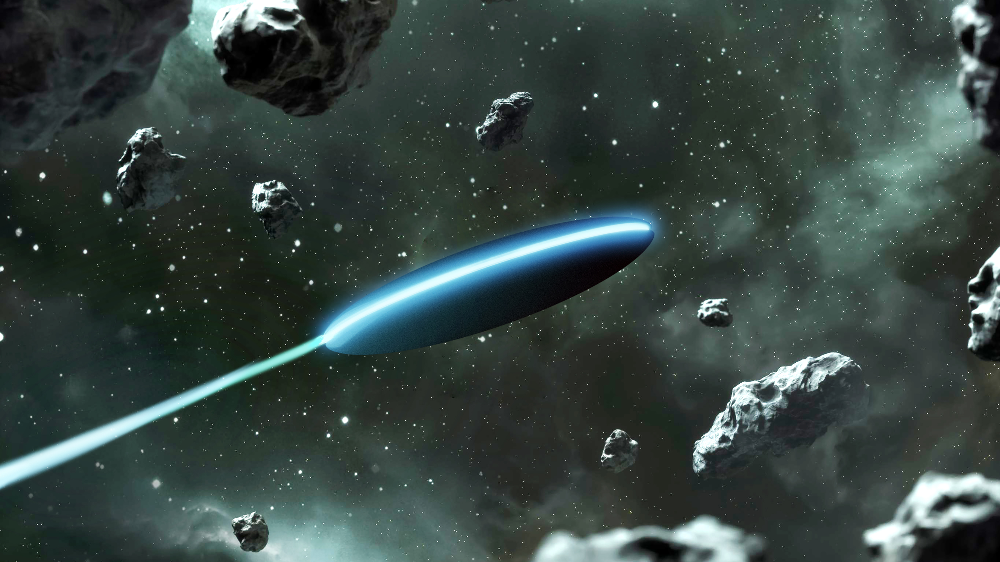

# Rocket Game

Welcome to the Rocket Game! This is a simple interactive game implemented in C++ using the ncurses library.
<!-- Include Font Awesome CSS -->
<link rel="stylesheet" href="https://cdnjs.cloudflare.com/ajax/libs/font-awesome/5.15.4/css/all.min.css" />

<!-- Add an icon in the README -->
<i class="fas fa-rocket"></i>
:rocket: 



## Features

- Navigate a rocket through obstacles
- Collect power-ups for score boosts
- Three levels of increasing difficulty
- Interactive controls

## Prerequisites

Before running the game, ensure you have the following installed:

- C++ compiler
- ncurses library [MAC-specific]

## Getting Started

1. **Clone the Repository**
   ```bash
   git clone https://github.com/your-username/rocket-game.git
   ```
2.**Compile the Game**
Navigate to the Game folder
```bash
cd rocket-game
```
Compile the game program
```bash
g++ -o rocket_game main.cpp -lncurses
```
3.**Run the Game**
```bash
./rocket_game
```

------------------------
## Controls

-W/S: Move the Rocket up/down
-A/D: Move the Rocket Left/Right [ACTIVATED IN LEVEL 3]
-F: Fire Lazer from the rocket's nose which can destroy the meteor it strikes [ACTIVATED IN LEVEL 3]
-Q: Quit the game which playing

## Gameplay

Rocket And Meteros :

Welcome to Rocket Adventure, where you embark on an exhilarating journey through the vast expanse of space! Take control of your rocket as you navigate through a series of challenging obstacles, collect power-ups, and strive to achieve the highest score possible. This README guide will provide you with all the necessary information to dive into the adventure.

**Gameplay Overview**:

*Objective*: Navigate the rocket through space, avoiding collisions with obstacles while collecting power-ups to increase your score.

*Obstacles*:

-Meteors: Beware of meteors drifting through space. Colliding with them will result in a game over.
-Power-ups: Collect power-ups marked as [o] to boost your score by 50 points. Seize them whenever possible to maximize your score.

*Levels*:
-Level 1 (Score < 500): Begin your journey at a leisurely pace. The speed is slow, allowing for easier navigation through space.
-Level 2 (500 ≤ Score < 1000): As you progress, the challenge intensifies. The speed increases to a medium pace, testing your reflexes and agility.
-Level 3 (Score ≥ 1000): Reach the pinnacle of space exploration. The speed becomes fast, and additional challenges await with air-drops [^] threatening to destroy your rocket if its tail is hit.

##Contributing

Found a bug or want to improve the game? Contributions are welcome! Feel free to open an issue or submit a pull request.
